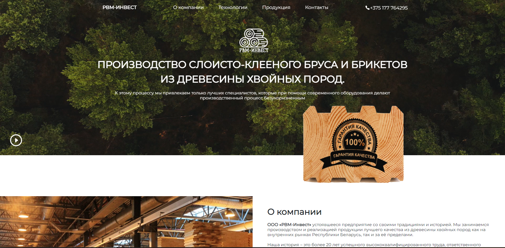

## Projects Title:

Business card website RVM-INVEST

## About The Project:

This application is a business card website for the commercial organization, that was created by my own design.

On the website, a user can get acquainted with the history of the company, learn about products and production technologies. He can also find the supplier's contacts or leave his own in the feedback form.
The site saves information from the feedback form in a Google sheet for further analysis by the company manager (it was the customer's wish).

## Built With:

- React
- TypeScript
- Module CSS
- React-hook-form
- Yup
- React-player

## Usage:

A user just needs to get acquainted with the information,
that is presented on different pages of the site.
A user can leave his contact in the feedback form and the manager of the company will contact.

## Contact:

GorelovaP

- LinkedIn: https://www.linkedin.com/in/polin%D0%B0-gorelova/
- GitHub: https://github.com/GorelovaP
- Email: gorelic2000p@gmail.com

## License:

MIT License

Copyright (c) [year] [fullname]

Permission is hereby granted, free of charge, to any person obtaining a copy
of this software and associated documentation files (the "Software"), to deal
in the Software without restriction, including without limitation the rights
to use, copy, modify, merge, publish, distribute, sublicense, and/or sell
copies of the Software, and to permit persons to whom the Software is
furnished to do so, subject to the following conditions:

The above copyright notice and this permission notice shall be included in all
copies or substantial portions of the Software.

THE SOFTWARE IS PROVIDED "AS IS", WITHOUT WARRANTY OF ANY KIND, EXPRESS OR
IMPLIED, INCLUDING BUT NOT LIMITED TO THE WARRANTIES OF MERCHANTABILITY,
FITNESS FOR A PARTICULAR PURPOSE AND NONINFRINGEMENT. IN NO EVENT SHALL THE
AUTHORS OR COPYRIGHT HOLDERS BE LIABLE FOR ANY CLAIM, DAMAGES OR OTHER
LIABILITY, WHETHER IN AN ACTION OF CONTRACT, TORT OR OTHERWISE, ARISING FROM,
OUT OF OR IN CONNECTION WITH THE SOFTWARE OR THE USE OR OTHER DEALINGS IN THE
SOFTWARE.

